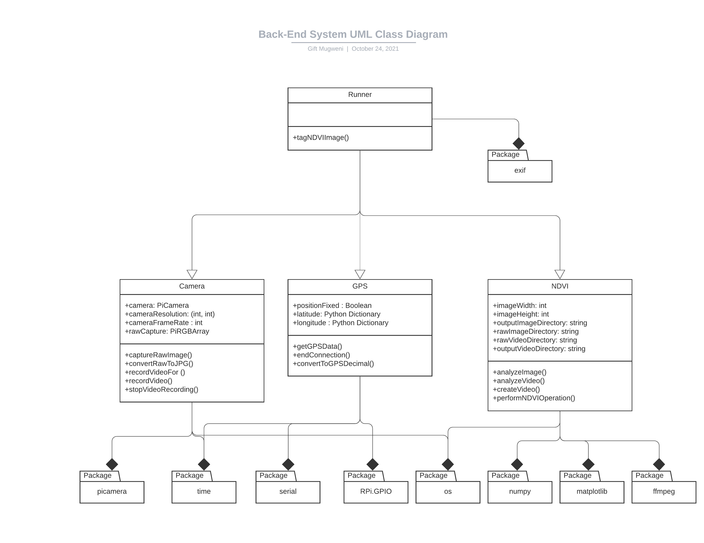
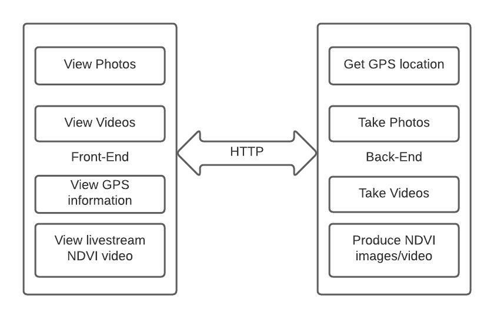

# Raspberry Pi Based InfragramCamera for Agricultural Applications
## _By Gift Isheunopa Taurai Mugweni_


This repository contains Python code that was written for an undergraduate final-year project (EEE4022S) at
the University of Cape Town. The aim of the project was to design and build a low-cost Raspberry Pi based 
infra-gram system capable of producing Normalized Difference Vegetation Index NDVI images or videos.

As such, a description of the scripts and how to set then up is provided below.

## Setting up environment.

### Hardware Requirements 

These scripts were tested using the following hardware

- [Raspberry Pi 4Model B -8GB ](https://www.robotics.org.za/PI4-8GB)
- [Raspberry PiNoIR CameraBoard V2 ](https://www.robotics.org.za/W11634)
- [GSM/GPS SIM868 HAT for Raspberry Pi](https://www.robotics.org.za/W13460)

### Software Requirements

The following softare is required to be installed on the device

- ImageMagick
- FFmpeg

### Installing libraries

A Make file has been provided for the project that allows for the setting up of a virtual environment and the installing
of the required library. To run the make file simply enter the below command in the root directory.

```bash

make

```

To activate the virtual environment, enter the below command

```bash

source ./venv/bin/activate

```


## Running Program

To start the web server that executes the [app.py](src/app.py) script, simply enter the below command in the root directory.

```bash

make run

```

Please note: ensure that you run all scripts from the root directory so as to not affect the file referencing used in the other scripts

## Code Structure

The code is split into the Front-end which is a series of HTML pages located in the [templates](src/templates) directory and a back-end 
consisting of the [camera.py](src/camera.py), [gps.py](src/gps.py), [ndvi.py](src/ndvi.py) and [runner.py](src/runner.py) scripts. These 
scripts are related as shown by the image below. Finally, the [app.py](src/app.py) script serves as the intergrating script that starts 
up the Flask webserver and initializes the backed-end classes.



Regarding key functions of the system, the block diagram below illustrates the core functionality

